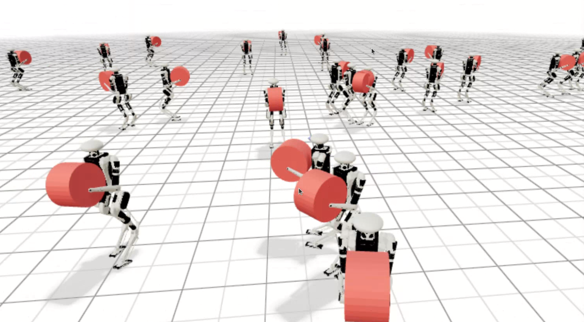

# mjlab for digit

**This open-source repository aims to accelerate academic research in RL and welcomes collaboration from anyone interested in contributing.**

[](https://github.com/mujocolab/mjlab/actions/workflows/ci.yml?query=branch%3Amain)
[](https://mujocolab.github.io/mjlab/)
[](https://github.com/mujocolab/mjlab/blob/main/LICENSE)
[](https://mujocolab.github.io/mjlab/nightly/)
[](https://pypi.org/project/mjlab/)


mjlab combines [Isaac Lab](https://github.com/isaac-sim/IsaacLab)'s manager-based API with [MuJoCo Warp](https://github.com/google-deepmind/mujoco_warp), a GPU-accelerated version of [MuJoCo](https://github.com/google-deepmind/mujoco).
The framework provides composable building blocks for environment design,
with minimal dependencies and direct access to native MuJoCo data structures.

## Getting Started

mjlab requires an NVIDIA GPU for training. macOS is supported for evaluation only.

## Training Examples

### 1. Velocity Tracking

Train a Digit V3 humanoid to follow velocity commands on flat terrain:

```bash
uv run train Mjlab-Velocity-Flat-Digit-V3   --env.scene.num-envs 2048   --agent.max-iterations 12000
```

```bash
uv run train Mjlab-Velocity-Flat-Digit-V3-Load   --env.scene.num-envs 2048   --agent.max-iterations 12000
```

**Multi-GPU Training:** Scale to multiple GPUs using `--gpu-ids`:

```bash
uv run train Mjlab-Velocity-Flat-Digit-V3 \
  --gpu-ids "[0, 1]" \
  --env.scene.num-envs 4096
```

See the [Distributed Training guide](https://mujocolab.github.io/mjlab/main/source/training/distributed_training.html) for details.

Evaluate a policy while training (fetches latest checkpoint from Weights & Biases):

```bash
uv run play Mjlab-Velocity-Flat-Digit-V3 --wandb-run-path your-org/mjlab/run-id
```
### 3. Sanity-check with Dummy Agents

Use built-in agents to sanity check your MDP before training:

```bash
uv run play Mjlab-Your-Task-Id --agent zero  # Sends zero actions
uv run play Mjlab-Your-Task-Id --agent random  # Sends uniform random actions
```

When running motion-tracking tasks, add `--registry-name your-org/motions/motion-name` to the command.


## Documentation

Full documentation is available at **[mujocolab.github.io/mjlab](https://mujocolab.github.io/mjlab/)**.

## Reproducibility

Every training run automatically saves a snapshot to `logs/rsl_rl/<experiment>/<timestamp>/`:

```
git/
  commit.txt    — exact git commit hash
  clean.patch   — git diff, replayable with `git apply`
  mjlab.diff    — rsl_rl git snapshot (for reference)
snapshot/
  src/mjlab/... — full copy of every modified source file
params/
  env.yaml      — serialized environment config
  agent.yaml    — serialized agent config
```

**To reproduce a run:**

```bash
LOG=logs/rsl_rl/digit_velocity_flat/<name_of_log>

# Restore modified source files
cp -r $LOG/snapshot/* .

# Then train
uv run train Mjlab-Velocity-Flat-Digit-V3
```

**Best practice:** commit your changes before training. Then `commit.txt` alone is enough:

```bash
git checkout $(cat $LOG/git/commit.txt)
uv run train Mjlab-Velocity-Flat-Digit-V3
```

## License

mjlab is licensed under the [Apache License, Version 2.0](LICENSE).

### Third-Party Code

Some portions of mjlab are forked from external projects:

- **`src/mjlab/utils/lab_api/`** — Utilities forked from [NVIDIA Isaac
  Lab](https://github.com/isaac-sim/IsaacLab) (BSD-3-Clause license, see file
  headers)

Forked components retain their original licenses. See file headers for details.

## Acknowledgments

mjlab wouldn't exist without the excellent work of the Isaac Lab team, whose API
design and abstractions mjlab builds upon.

Thanks to the MuJoCo Warp team — especially Erik Frey and Taylor Howell — for
answering our questions, giving helpful feedback, and implementing features
based on our requests countless times.
